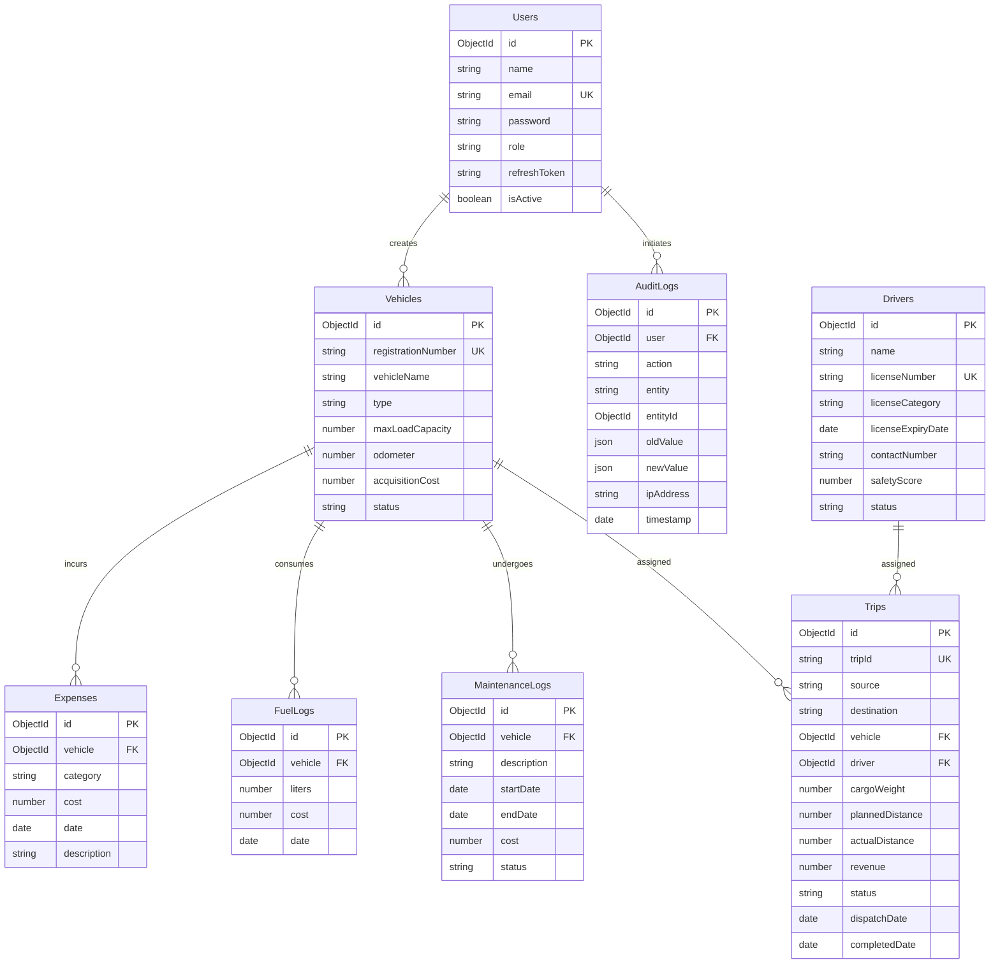
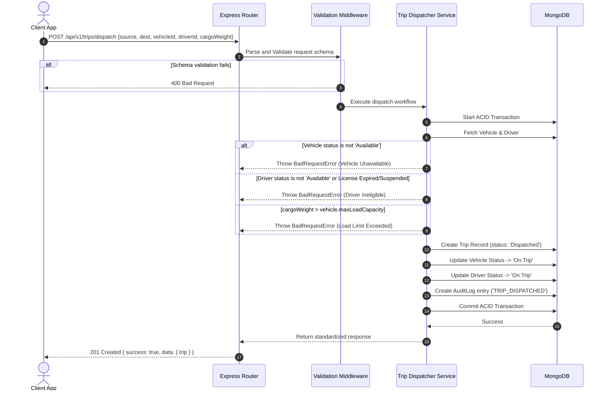

# TransitOps: Smart Transport Operations Platform (ERP)

TransitOps is an enterprise-grade, production-ready Transport Management ERP built to optimize fleet utilization, automate logistics dispatch workflows, track operational expenses, enforce compliance, and provide real-time dashboard analytics.

The platform is designed using a **Feature-Based Modular Clean Architecture** (vertical slices), ensuring that business rules are strictly validated on the backend and database transactions maintain absolute integrity.

---

## 1. Problem Statement vs. TransitOps Solution

### 1.1 The Operational Challenges
1.  **Manual Dispatch Scheduling**: Dispatchers rely on memory or spreadsheets, leading to conflicts where a driver or vehicle is assigned to multiple active trips concurrently.
2.  **Safety & Compliance Risk**: Driving licenses expire unnoticed or suspended drivers are dispatched, exposing the organization to massive legal liabilities and safety violations.
3.  **Underutilized Assets**: Fleet managers lack visibility on real-time vehicle statuses (`Available`, `On Trip`, `In Shop`, `Retired`), resulting in inactive trucks and lost revenue.
4.  **Opaque Expense Tracking**: Fuel costs, toll fees, and maintenance charges are recorded disjointedly, preventing accurate calculation of asset profitability and ROI.
5.  **Lack of Accountability**: System updates are untracked, making it impossible to audit who created, modified, dispatched, or completed specific operations.

### 1.2 The TransitOps Solution
TransitOps solves these core problems by digitizing the logistics lifecycle and enforcing the following automated mechanisms:
*   **Decoupled Multi-Role RBAC**: Enforces strict operational boundaries between Fleet Managers, Dispatchers, Safety Officers, and Financial Analysts.
*   **State Machine Automations**: The system coordinates status updates. Dispatching a trip automatically transitions the vehicle and driver to `On Trip`. Completing/canceling the trip automatically restores them to `Available`.
*   **Automated Validation Engine**: Backend validation guards reject any dispatch if the cargo exceeds max load capacity, a vehicle is `In Shop` / `Retired`, or a driver's license is expired/suspended.
*   **Mongoose-Level Integrity**: Uses isolated models and MongoDB transactions (`mongoose transactions`) to ensure that trip states, odometer readings, fuel logs, and expense sheets remain synchronized without raw data collisions.
*   **Structured Auditing**: Every write action (logins, creates, updates, status changes) automatically generates an entry in the `AuditLogs` collection, detailing the initiator, target entity, timestamp, and field differences.

---

## 2. Directory Structure

TransitOps uses a monorepo setup consisting of a decoupled `frontend` and `backend`. Both services are structured modularly around business modules to allow scaling.

```text
TransitOps/
├── backend/
│   ├── src/
│   │   ├── config/              # Shared integrations (db.js, logger.js)
│   │   ├── errors/              # Custom HTTP error classes (AppError.js, NotFoundError.js...)
│   │   ├── middlewares/         # Global request interceptors (auth, rbac, error, rate-limiter)
│   │   ├── modules/             # Business modules (Vertical Slices)
│   │   │   ├── auth/            # 0. User identity, signup, and login
│   │   │   ├── dashboard/       # 1. KPI aggregation & active log overviews
│   │   │   ├── vehicle-registry/# 2. Fleet vehicles management
│   │   │   ├── driver-safety-profile/ # 3. Drivers registry & compliance scores
│   │   │   ├── trip-dispatcher/ # 4. Trip booking, routes, and transaction dispatches
│   │   │   ├── maintenance/     # 5. Fleet servicing & active repairs logs
│   │   │   ├── fuel-expense-management/ # 6. Fuel logs & miscellaneous operational costs
│   │   │   ├── reports-analysis/# 7. ROI analytics & CSV summaries
│   │   │   ├── settings-rbac/   # 8. Access controls and dynamic permissions
│   │   │   └── audit/           # Audit trail logging utilities
│   │   ├── utils/               # Utilities (jwt helpers, multer upload config)
│   │   ├── app.js               # Express application definitions & security configurations
│   │   └── server.js            # Server entry point & DB connection init
│   ├── uploads/                 # Local uploads storage (git-ignored)
│   ├── package.json
│   └── .env.example
├── frontend/
│   ├── src/
│   │   ├── assets/              # Branding assets & SVG sprite sheets
│   │   ├── components/          # Reusable shared presentational components
│   │   │   ├── ui/              # Base design system atoms (Buttons, Inputs, Tables)
│   │   │   └── layout/          # Application chrome framework (Sidebar, Navbar)
│   │   ├── config/              # Global configurations
│   │   ├── context/             # Global contexts (AuthContext)
│   │   ├── features/            # Feature modules (matches backend slices)
│   │   │   ├── auth/            # Login and security views
│   │   │   ├── dashboard/       # Operations dashboard with charts
│   │   │   ├── vehicle-registry/
│   │   │   ├── driver-safety-profile/
│   │   │   ├── trip-dispatcher/
│   │   │   ├── maintenance/
│   │   │   ├── fuel-expense-management/
│   │   │   ├── reports-analysis/
│   │   │   └── settings-rbac/
│   │   ├── hooks/               # Global custom hooks
│   │   ├── lib/                 # Third-party configurations (Axios, React Query)
│   │   ├── router/              # Route routing & RBAC route guards
│   │   ├── utils/               # Common helper formatters
│   │   ├── index.css            # Styling directives (Tailwind CSS v4)
│   │   ├── main.jsx             # React entry point mounting file
│   │   └── App.jsx              # Main wrapper with state providers
│   ├── package.json
│   └── vite.config.js
├── .gitignore
└── README.md
```

---

## 3. Database Entities & Relationships

We utilize MongoDB with Mongoose to represent entities. Relationships are modeled via references (`ObjectId` population).



---

## 4. Role-Based Access Control (RBAC) Matrix

Permissions are enforced at the API route level via `authenticate` and `authorize(...roles)` middlewares.

| System Module | Admin | Fleet Manager | Dispatcher | Safety Officer | Financial Analyst | Driver |
| :--- | :---: | :---: | :---: | :---: | :---: | :---: |
| **0. Authentication** | Full | Full | Full | Full | Full | Profile Only |
| **1. Dashboard (KPIs)** | Read | Read | Read | Read | Read | Denied |
| **2. Vehicle Registry** | Full | Full | Read | Read | Read | Denied |
| **3. Driver Profile** | Full | Read | Read | Full | Read | Denied |
| **4. Trip Dispatcher** | Full | Full | Full | Read | Read | View Assigned |
| **5. Maintenance Logs** | Full | Full | Read | Read | Read | Read / Create |
| **6. Fuel & Expenses** | Full | Full | Read | Denied | Full | Create Fuel |
| **7. Reports & Analytics**| Full | Read | Denied | Read | Full | Denied |
| **8. Settings & RBAC** | Full | Read | Denied | Denied | Denied | Denied |
| **9. Audit Logs** | Read | Denied | Denied | Denied | Denied | Denied |

---

## 5. Core Mathematical & Aggregation Formulations

All analytical computations are performed inside MongoDB aggregation pipelines on the backend to avoid processing bottlenecks on the client:

### 5.1 Fuel Efficiency (km/L)
Calculated per vehicle or across the entire fleet:
$$\text{Fuel Efficiency} = \frac{\sum(\text{Actual Trip Distances})}{\sum(\text{Fuel Liters Consumed})}$$

### 5.2 Fleet Utilization (%)
Calculated dynamically to measure asset usage:
$$\text{Fleet Utilization} = \frac{\text{Count of Active Vehicles (On Trip)}}{\text{Total Active Fleet (Available + On Trip)}} \times 100\%$$

### 5.3 Total Operational Cost ($)
The cumulative cost of running a vehicle:
$$\text{Total Operational Cost} = \sum(\text{Fuel Log Cost}) + \sum(\text{Completed Maintenance Cost}) + \sum(\text{Other Expenses})$$

### 5.4 Vehicle Return on Investment (ROI)
Yields the relative profitability of each vehicle:
$$\text{Vehicle ROI} = \frac{\text{Total Trip Payouts (Revenue)} - \text{Total Operational Cost}}{\text{Acquisition Cost}}$$

---

## 6. System Core Workflows

### 6.1 Trip Dispatch Workflow (Mongoose Transaction Protected)


---

Made by Mohit Mudgil
   ```
